# FailCore Architecture & Design Principles

## 1. High-Level Overview

FailCore is a **deterministic execution safety layer** designed for AI agents.

Instead of relying on prompts, static analysis, or perimeter firewalls,
FailCore operates **at the Python runtime boundary**, mediating security-sensitive
operations (network, filesystem, process execution) *at execution time*.

The core philosophy is **secure by default**:

> An agent has no access to the outside world unless that capability is
> explicitly granted and continuously enforced.

FailCore is not a planner.
FailCore is not an agent framework.

FailCore exists to make **execution observable, enforceable, and stoppable**.

---

## 2. System Architecture

FailCore injects an execution gate between agent logic and side-effectful
runtime interfaces.

```mermaid
graph TD
    subgraph User Space
        A[AI Agent / LLM Logic] -->|Calls| B[Python Runtime Interfaces]
        B -->|Mediated by| C{FailCore Execution Gate}

        subgraph FailCore Runtime
            C -->|1. Inspect Context| D[Context Manager]
            C -->|2. Evaluate Policy| E[Policy Engine]

            E -->|ALLOW| F[Execute Operation]
            E -->|DENY| G[Block & Raise Error]
            E -->|AUDIT| H[Trace & Forensic Logger]
        end

        F --> I[Python Runtime → OS]
    end
```

---

## 3. Core Components

### 3.1 Execution Interceptor (Runtime Mediation)

FailCore enforces execution mediation by wrapping **security-sensitive Python
runtime interfaces**.

Current implementation focuses on:

- **Network access**
  - Runtime hooks at the `socket` layer
- **Filesystem access**
  - Controlled interception of `open`, `os.open`, and `pathlib` operations

---

### 3.2 Policy Engine

The policy engine evaluates every intercepted action **at execution time**.

- Fail-safe by design
- Low overhead evaluation
- Explicit capability model

---

### 3.3 Network Boundary Enforcement

FailCore treats outbound network access as a privileged operation.

DNS is resolved immediately before connection to mitigate SSRF and DNS rebinding.

---

### 3.4 Trace-First Forensic Logging

Every execution decision emits a structured trace event.

---

## 4. Replay as a First-Class Primitive

Execution traces can be replayed without side effects for audit and debugging.

---

## 5. Design Trade-offs

- Runtime mediation instead of library hooks
- Fail-safe over fail-open
- Execution boundaries over full sandboxing

---

## 6. Limitations (Alpha)

- Native C extensions may bypass mediation
- Subprocess handling is heuristic-based (WIP)

---

## 7. Roadmap

- Kernel-assisted enforcement (eBPF)
- Unified policy model
- Advanced replay tooling

---

## 8. Summary

Autonomy without execution boundaries is liability.

FailCore ensures every agent action is **observable, accountable, and stoppable**.
